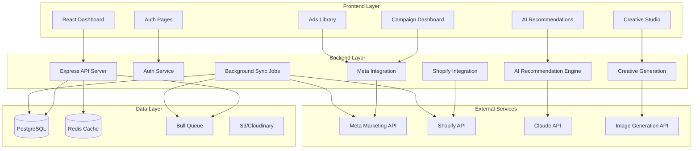
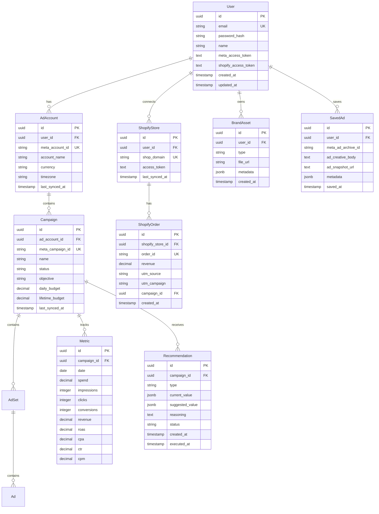

# Meta Ads Management Platform - Planning Document

## Project Overview

A comprehensive AI-powered Meta Ads management platform that integrates with Meta Business, Shopify, and AI services to provide automated campaign optimization, revenue attribution, competitor research, and creative generation capabilities.

---

## Architecture Design

### Technology Stack

#### Frontend
- **Framework**: React with TypeScript
- **Build Tool**: Vite
- **Styling**: Tailwind CSS
- **State Management**: React Query + Zustand
- **UI Components**: shadcn/ui
- **Charts**: Recharts or Chart.js
- **Forms**: React Hook Form + Zod validation

#### Backend
- **Framework**: Node.js with Express (or NestJS for better structure)
- **Language**: TypeScript
- **API Style**: RESTful API
- **Authentication**: JWT + OAuth 2.0
- **Background Jobs**: Bull Queue with Redis
- **Caching**: Redis

#### Database
- **Primary Database**: PostgreSQL
- **ORM**: Prisma
- **Caching Layer**: Redis
- **File Storage**: AWS S3 or Cloudinary (for generated images)

#### External Integrations
- **Meta Marketing API**: Campaign management, insights, ads library
- **Shopify API**: Order and product sync
- **AI Service**: Claude API (Anthropic) for recommendations
- **Image Generation**: Nano Banana or Stability AI

#### DevOps & Infrastructure
- **Hosting**: Vercel (frontend) + Railway/Render (backend)
- **Database**: Supabase or Railway PostgreSQL
- **Background Jobs**: Railway Redis
- **Monitoring**: Sentry for error tracking
- **Analytics**: PostHog or Mixpanel

---

## System Architecture



---

## Database Schema Design

### Core Tables



---

## API Endpoint Structure

### Authentication Routes
```
POST   /api/auth/register              - Register new user
POST   /api/auth/login                 - Login user
POST   /api/auth/logout                - Logout user
GET    /api/auth/me                    - Get current user
POST   /api/auth/meta/connect          - Initiate Meta OAuth
GET    /api/auth/meta/callback         - Meta OAuth callback
POST   /api/auth/shopify/connect       - Initiate Shopify OAuth
GET    /api/auth/shopify/callback      - Shopify OAuth callback
```

### Campaign Management
```
GET    /api/accounts                   - List ad accounts
GET    /api/accounts/:id/campaigns     - List campaigns
GET    /api/campaigns/:id              - Get campaign details
GET    /api/campaigns/:id/metrics      - Get campaign metrics
GET    /api/campaigns/:id/insights     - Get detailed insights
POST   /api/campaigns/sync             - Trigger manual sync
PUT    /api/campaigns/:id              - Update campaign
```

### AI Recommendations
```
GET    /api/recommendations            - List all recommendations
POST   /api/recommendations/generate   - Generate new recommendations
GET    /api/recommendations/:id        - Get recommendation details
PUT    /api/recommendations/:id/approve - Approve recommendation
PUT    /api/recommendations/:id/reject  - Reject recommendation
GET    /api/recommendations/:id/results - Get execution results
```

### Shopify Integration
```
GET    /api/shopify/stores             - List connected stores
GET    /api/shopify/orders             - List orders
GET    /api/shopify/products           - List products
GET    /api/shopify/attribution        - Get revenue attribution
POST   /api/shopify/sync               - Trigger manual sync
```

### Ads Library
```
GET    /api/ads-library/search         - Search ads
GET    /api/ads-library/:id            - Get ad details
POST   /api/ads-library/save           - Save ad to collection
GET    /api/ads-library/saved          - List saved ads
DELETE /api/ads-library/saved/:id     - Remove saved ad
```

### Creative Studio
```
GET    /api/creatives/templates        - List templates
POST   /api/creatives/generate         - Generate image
POST   /api/creatives/upload           - Upload brand asset
GET    /api/creatives/assets           - List brand assets
DELETE /api/creatives/assets/:id      - Delete brand asset
```

---

## Security & Best Practices

### Authentication & Authorization
- JWT tokens with refresh token rotation
- Encrypted storage of OAuth tokens (AES-256)
- Rate limiting on all endpoints
- CORS configuration for frontend domain
- Input validation and sanitization

### Data Protection
- Environment variables for secrets
- Database connection pooling
- SQL injection prevention via ORM
- XSS protection headers
- HTTPS only in production

### API Rate Limiting
- Meta API: Respect rate limits (200 calls/hour for Ads Library)
- Implement exponential backoff
- Queue system for bulk operations
- Cache frequently accessed data

---

## Implementation Phases

### Phase 1: Foundation (Weeks 1-2)
**Goal**: Set up project infrastructure and basic authentication

#### Backend Setup
- [ ] Initialize Node.js/Express project with TypeScript
- [ ] Set up Prisma with PostgreSQL
- [ ] Configure environment variables
- [ ] Implement user authentication (register/login)
- [ ] Set up JWT token management
- [ ] Create basic API structure

#### Frontend Setup
- [ ] Initialize React + Vite + TypeScript project
- [ ] Set up Tailwind CSS and shadcn/ui
- [ ] Create routing structure (React Router)
- [ ] Implement authentication pages (login/register)
- [ ] Set up API client with axios/fetch
- [ ] Create protected route wrapper

#### Database
- [ ] Design and create Prisma schema
- [ ] Run initial migrations
- [ ] Seed test data

---

### Phase 2: Meta Integration (Weeks 3-4)
**Goal**: Connect to Meta API and fetch campaign data

#### Meta OAuth
- [ ] Implement Meta OAuth 2.0 flow
- [ ] Store encrypted access tokens
- [ ] Handle token refresh
- [ ] Request required permissions:
  - `ads_management`
  - `ads_read`
  - `business_management`
  - `read_insights`

#### Campaign Data Fetching
- [ ] Fetch ad accounts
- [ ] Fetch campaigns, ad sets, ads
- [ ] Fetch insights and metrics with:
  - Spend, impressions, clicks, conversions
  - Attribution windows (1-day, 7-day, 28-day)
  - Demographic breakdowns
  - Placement performance (Feed, Stories, Reels)
  - Creative performance
  - Custom conversions and events
- [ ] Store data in database
- [ ] Create sync service

#### Dashboard UI
- [ ] Campaign list view
- [ ] Campaign detail view with hierarchy (campaigns → ad sets → ads)
- [ ] Metrics display (ROAS, CPA, CTR, CPM, Conversion Rate, CAC)
- [ ] Date range selector with presets
- [ ] Trend indicators (DoD, WoW, MoM)
- [ ] Moving averages (7-day, 30-day)
- [ ] Anomaly detection (sudden drops/spikes)

#### Background Jobs
- [ ] Set up Bull Queue with Redis
- [ ] Implement scheduled sync (every 4-6 hours)
- [ ] Set up webhook listeners for immediate campaign changes
- [ ] Error handling and retry logic
- [ ] Exponential backoff for rate limits

#### Benchmarking System
- [ ] Create industry benchmarks database
- [ ] Store benchmark data by:
  - Industry (e-commerce, SaaS, etc.)
  - Ad spend tiers
  - Geographic regions
  - Platform (Facebook vs Instagram)
- [ ] Display user metrics vs benchmarks

---

### Phase 3: Recommendation System (Weeks 5-6)
**Goal**: Build recommendation workflow and execution system (AI model integration deferred)

> [!IMPORTANT]
> AI model is already built and working. This phase focuses on building the platform infrastructure to receive, display, and execute recommendations. AI integration will happen after core platform is complete.

#### Recommendation Infrastructure
- [ ] Design recommendation data structure
- [ ] Create recommendation database schema with confidence scores
- [ ] Build recommendation API endpoints (CRUD)
- [ ] Implement mock recommendation generator (for testing)
- [ ] Create recommendation types enum:
  - Budget increase/decrease (with percentage/amount)
  - Pause campaign
  - Audience expansion (lookalike %, interests)
  - Creative refresh
  - Bid adjustment (strategy changes)
  - Create new campaign

#### Recommendation Workflow
- [ ] Generate recommendations endpoint (mock data initially)
- [ ] Store recommendations with:
  - Current value
  - Suggested value
  - Reasoning/explanation
  - Expected outcomes (projected ROAS change)
  - Confidence score
- [ ] List/filter recommendations API
- [ ] Approve recommendation endpoint
- [ ] Reject recommendation endpoint
- [ ] Execute approved recommendations via Meta API
- [ ] Track execution results and outcomes

#### UI Components
- [ ] Recommendations dashboard page
- [ ] Priority sorting (high impact first)
- [ ] Recommendation cards with:
  - Type and reasoning display
  - Current vs suggested values
  - Expected outcomes
  - Confidence indicators
- [ ] Approve/reject action buttons
- [ ] Bulk action support
- [ ] Preview mode (show what will change)
- [ ] Execution status indicators
- [ ] Results monitoring view
- [ ] Before/after metrics comparison
- [ ] Success rate dashboard

#### Execution Engine
- [ ] Meta API execution service for:
  - Campaign updates (`POST /{campaign-id}`)
  - Ad set modifications (`POST /{adset-id}`)
  - Ad updates (`POST /{ad-id}`)
  - New campaign creation (`POST /{ad-account-id}/campaigns`)
- [ ] Validation before execution
- [ ] Audit trail logging
- [ ] Undo capability (revert within 24 hours)
- [ ] Spending limits (max daily budget changes)
- [ ] User-defined approval thresholds
- [ ] Error handling and retry logic
- [ ] Alert system for negative impacts

---

### Phase 4: Shopify Integration (Weeks 7-8)
**Goal**: Connect Shopify and implement revenue attribution

#### Shopify OAuth
- [ ] Implement Shopify OAuth flow
- [ ] Request scopes: `read_orders`, `read_products`, `read_customers`, `read_analytics`
- [ ] Store encrypted access tokens
- [ ] Handle multi-store support

#### Data Sync
- [ ] Fetch orders with UTM parameters
- [ ] Fetch products (catalog for ad creation)
- [ ] Fetch customer data (LTV calculations)
- [ ] Fetch store analytics (conversion funnel)
- [ ] Sync on schedule (hourly)
- [ ] Store in database

#### Attribution Logic
- [ ] Match orders to campaigns via:
  - `utm_campaign` parameter
  - `utm_source` parameter
  - `ad_id` (if available)
- [ ] Implement attribution models:
  - First touch
  - Last touch
  - Multi-touch
- [ ] Calculate true ROAS with actual revenue
- [ ] Track customer journey
- [ ] Update metrics with attributed revenue
- [ ] Handle refund/return rates

#### Dashboard Updates
- [ ] Revenue attribution view with:
  - Attribution summary
  - Matched vs unmatched orders
  - Attribution confidence
- [ ] True ROAS calculations (Meta ROAS vs Shopify ROAS)
- [ ] Product performance table:
  - Best-selling products from ads
  - ROAS by product
  - Revenue by product
- [ ] Revenue breakdown:
  - Revenue by campaign/ad set/ad
  - Customer LTV by acquisition source
- [ ] Profitability view: Revenue - COGS - Ad Spend = Net Profit
- [ ] Scheduled reports (daily/weekly/monthly)
- [ ] CSV/PDF export
- [ ] Team sharing functionality

---

### Phase 5: Ads Library (Week 9)
**Goal**: Build competitor research portal

#### Meta Ads Library API
- [ ] Implement search endpoint (`GET /ads_archive`)
- [ ] Handle pagination
- [ ] Filter by:
  - Advertiser name, keyword, URL
  - Country code
  - Platform (Facebook/Instagram)
  - Media type
  - Status (active/all)
  - Date range
- [ ] Respect rate limits (~200 requests/hour)
- [ ] Implement caching (24 hours)

#### UI Portal
- [ ] Search interface with keyword input
- [ ] Filter controls:
  - Country dropdown
  - Platform toggle
  - Status filter
  - Date range picker
- [ ] Thumbnail gallery view
- [ ] Detail modal with:
  - Full ad preview
  - Ad copy display
  - CTA display
  - Engagement metrics (if available)
- [ ] Timeline view (track advertiser's campaign history)
- [ ] Save to collections/boards
- [ ] Organize saved ads
- [ ] Export/download creative
- [ ] Saved ads library

#### Analytics Features
- [ ] Track most active advertisers in niche
- [ ] Identify trending ad formats
- [ ] Analyze competitor messaging themes
- [ ] Competitor ad activity over time

---

### Phase 6: Creative Studio (Week 10)
**Goal**: Image generation and brand asset management

#### Image Generation (Nano Banana)
- [ ] Integrate Nano Banana API
- [ ] Implement generation endpoint
- [ ] Support features:
  - Text-to-image generation
  - Style transfer/editing
  - Background removal
  - Image upscaling
- [ ] Support multiple aspect ratios:
  - 1:1 (square - Feed)
  - 4:5 (portrait - Feed)
  - 9:16 (vertical - Stories/Reels)
  - 16:9 (landscape - Feed)
- [ ] Store generated images in S3/Cloudinary

#### Brand Assets
- [ ] Upload logo endpoint (PNG with transparency)
- [ ] Store color palette (hex codes)
- [ ] Font preferences
- [ ] Template system:
  - E-commerce product showcases
  - Seasonal/holiday themes
  - Announcement/launch templates
  - Testimonial/social proof formats
- [ ] Auto-apply branding to generated images
- [ ] Maintain style guide across all creatives

#### Creative Workflow UI
- [ ] Product description input or image upload
- [ ] Template library browser
- [ ] Format selection (1:1, 4:5, 9:16, 16:9)
- [ ] Generate multiple variations (3-5)
- [ ] Text overlay editor:
  - Add text layers
  - Position and style text
  - Add CTAs
- [ ] Brand application preview
- [ ] Export options:
  - Download images
  - Upload directly to Meta Ads Manager
  - Save to library

---

### Phase 7: Polish & Launch (Weeks 11-12)
**Goal**: Testing, optimization, and production deployment

#### Testing
- [ ] Unit tests for critical functions
- [ ] Integration tests for API endpoints
- [ ] E2E tests for key user flows
- [ ] Load testing for sync jobs

#### Monitoring & Analytics
- [ ] Set up Sentry for error tracking
- [ ] Implement user analytics (PostHog/Mixpanel)
- [ ] Create admin dashboard for monitoring
- [ ] Set up alerts for failures

#### Performance Optimization
- [ ] Database query optimization
- [ ] Implement caching strategy
- [ ] Optimize bundle size
- [ ] Lazy loading for routes

#### Documentation
- [ ] API documentation (Swagger/OpenAPI)
- [ ] User guide
- [ ] Developer setup guide
- [ ] Deployment guide

#### Deployment
- [ ] Deploy frontend to Vercel
- [ ] Deploy backend to Railway/Render
- [ ] Set up production database
- [ ] Configure Redis instance
- [ ] Set up domain and SSL
- [ ] Production environment variables

---

## Success Metrics & KPIs

### User Engagement
- Daily Active Users (DAU)
- Average session duration > 10 minutes
- Campaigns synced per user > 5
- Return user rate > 60%

### AI Performance
- Recommendation acceptance rate > 50%
- Average ROAS improvement > 15%
- Recommendation execution success rate > 95%

### Revenue Impact
- Average ROAS uplift per user
- Total ad spend managed through platform
- Revenue attributed through Shopify integration

### Technical Metrics
- API response time < 200ms (p95)
- Sync job success rate > 99%
- Uptime > 99.9%
- Error rate < 0.1%

---

## Risk Mitigation

### Technical Risks
- **Meta API rate limits**: Implement caching, queue system, exponential backoff
- **Token expiration**: Automatic refresh mechanism with user notification
- **Data sync failures**: Retry logic, error logging, manual sync option
- **AI API costs**: Set usage limits, cache recommendations, batch requests

### Business Risks
- **User adoption**: Focus on clear value proposition, onboarding flow
- **Competition**: Differentiate with AI recommendations and Shopify integration
- **Pricing**: Start with freemium model, premium features for power users

---

### Phase 8: AI Model Integration (Week 13)
**Goal**: Integrate the existing AI model into the platform

> [!NOTE]
> This phase happens after the core platform is fully functional. The AI model is already built and working separately.

#### AI Model Integration
- [ ] Review AI model API/interface
- [ ] Create integration service layer
- [ ] Replace mock recommendation generator with real AI model
- [ ] Map AI model output to recommendation data structure
- [ ] Handle AI model errors and fallbacks

#### Data Pipeline
- [ ] Fetch campaign metrics from database
- [ ] Format data for AI model input
- [ ] Send structured data to AI model
- [ ] Parse AI model response
- [ ] Validate recommendations before storing
- [ ] Store recommendations in database

#### Testing & Validation
- [ ] Test AI recommendations with real campaign data
- [ ] Validate recommendation quality
- [ ] Compare AI vs mock recommendations
- [ ] A/B test framework (optional)
- [ ] Monitor AI model performance
- [ ] Track recommendation acceptance rates

#### Optimization
- [ ] Tune AI model parameters based on user feedback
- [ ] Implement recommendation caching
- [ ] Batch recommendation generation
- [ ] Set usage limits for AI API costs
- [ ] Monitor and optimize response times

---

## Next Steps

1. **Review this planning document** and provide feedback
2. **Confirm technology stack** choices
3. **Set up development environment** (Phase 1)
4. **Begin implementation** following phased approach
5. **Regular check-ins** at end of each phase
